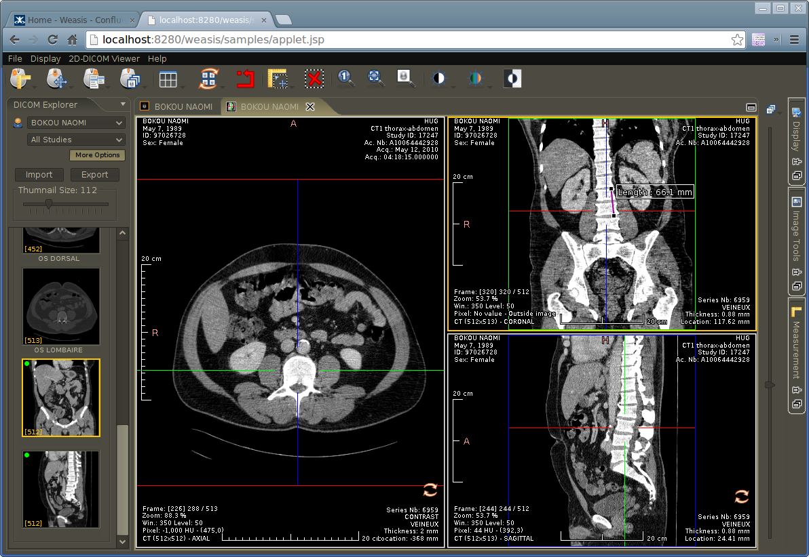

Simple launcher with an Applet or with Java Web Start
=====================================================

**THIS PROJECT IS OBSOLETE!** Use [weasis-pacs-connector 5](https://github.com/nroduit/weasis-pacs-connector) instead.

This project is an example on how to override the default package **weasis.war** without rebuilding it.

 * In pom.xml, change the Weasis version in &lt;properties>&lt;weasis.distribution.version>**x.x.x** (from Weasis 2.0 and later). This version must match to a distribution available in your local maven repository (see [How to build Weasis distribution](http://www.dcm4che.org/confluence/display/WEA/Building+Weasis+from+source "Build Weasis Distribution")) or from a [public Maven repository](http://dicom.vital-it.ch:8087/nexus/content/repositories/releases/org/weasis/weasis-distributions/).
 * Adapt .jsp or .jnlp files
 * Rebuild the .war file: `mvn clean package`
 * The new distribution file is located in target/web_dist/weasis.war
 * Deploy it and then go to the default page (ex. http://localhost:8080/weasis)

[See on demo server](http://dicom.vital-it.ch:8089/weasis/)
 

